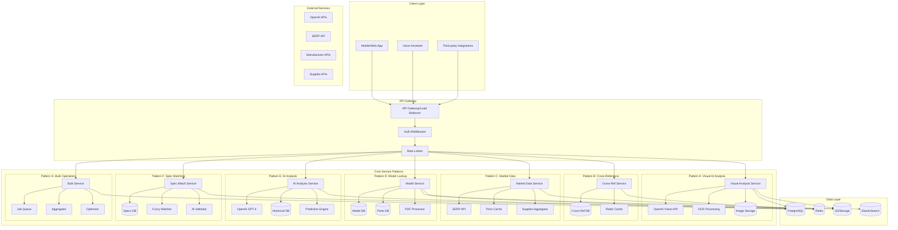
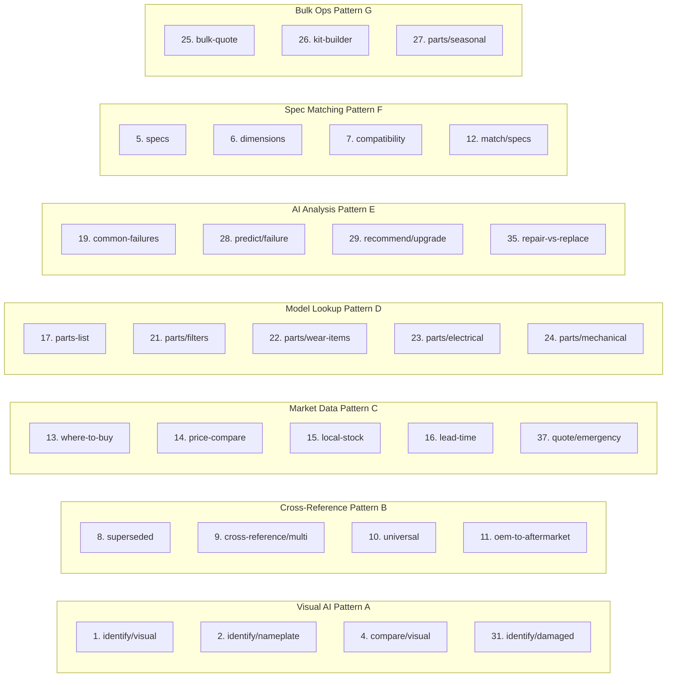
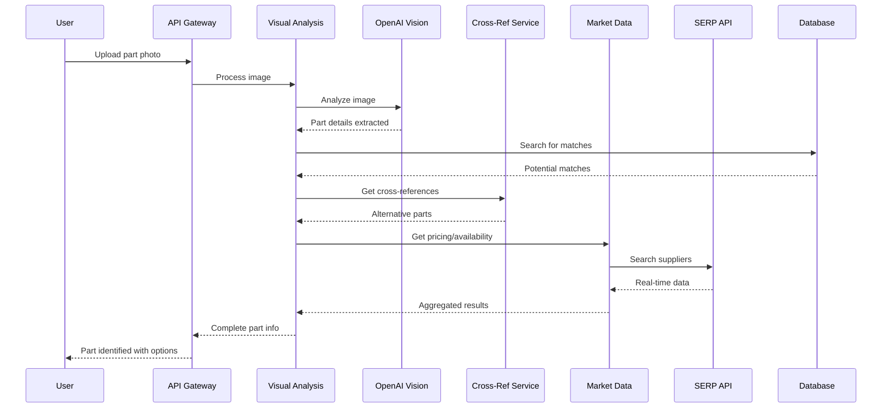
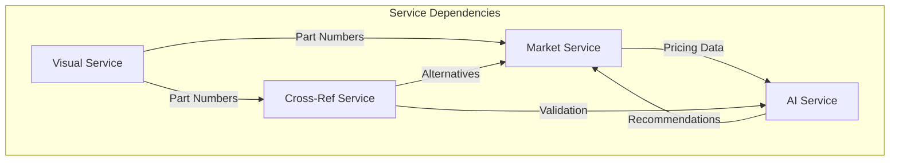
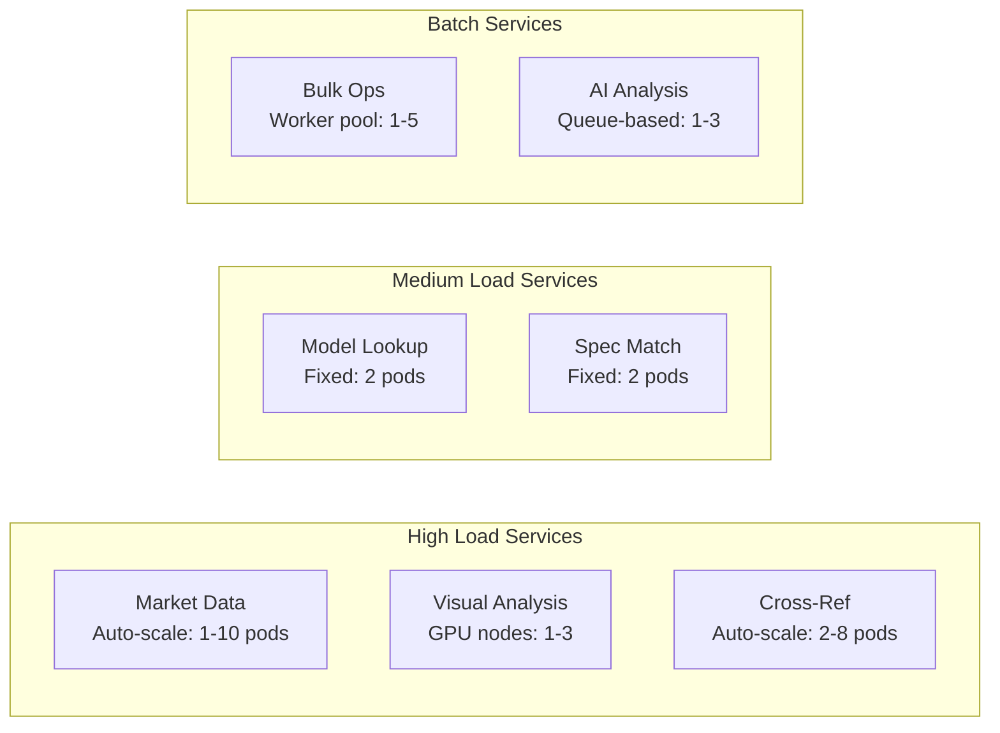
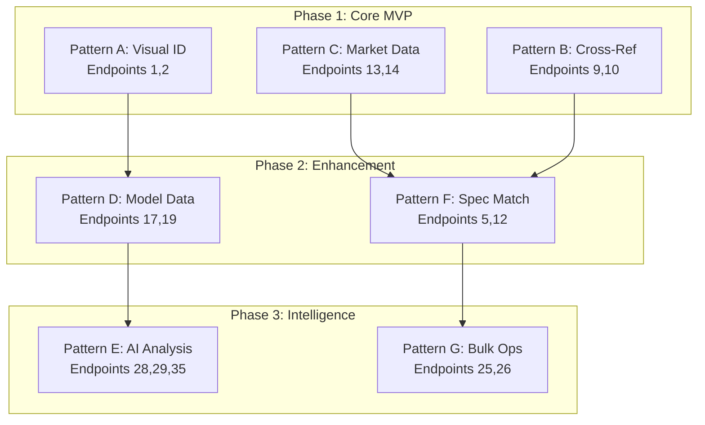
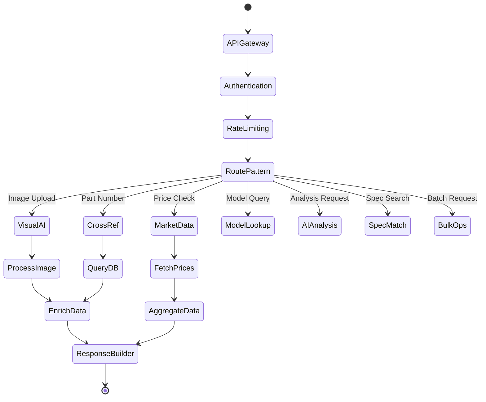
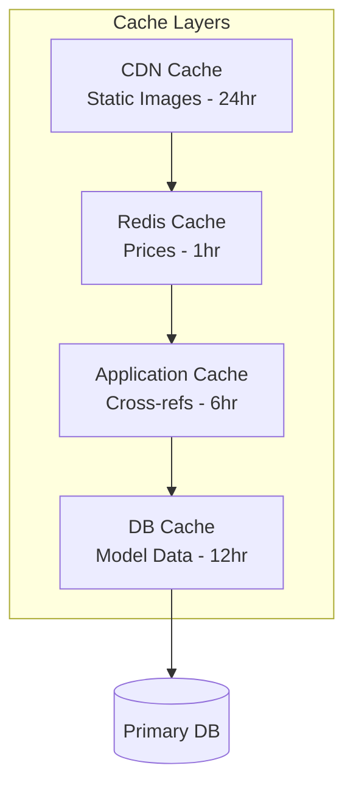

# Parts API Architecture Map

## System Architecture Overview

## Endpoint Pattern Mapping

## Data Flow Example: Part Identification Journey

## Service Communication Matrix

## Technology Stack by Pattern

| Pattern             | Primary Tech  | Secondary Tech | Data Store    | Cache |
| ------------------- | ------------- | -------------- | ------------- | ----- |
| **A: Visual AI**    | OpenAI Vision | TensorFlow     | PostgreSQL    | S3    |
| **B: Cross-Ref**    | PostgreSQL    | ElasticSearch  | PostgreSQL    | Redis |
| **C: Market Data**  | SERP API      | Scrapers       | PostgreSQL    | Redis |
| **D: Model Lookup** | PostgreSQL    | PDF Parser     | PostgreSQL    | Redis |
| **E: AI Analysis**  | OpenAI GPT-4  | Scikit-learn   | PostgreSQL    | Redis |
| **F: Spec Match**   | ElasticSearch | Fuzzy Logic    | ElasticSearch | Redis |
| **G: Bulk Ops**     | Bull Queue    | Node Workers   | PostgreSQL    | Redis |

## Scaling Strategy

## Priority Implementation Order

## Request/Response Flow

## Caching Strategy

This architecture provides:

- **Modularity**: Each pattern can be developed/scaled independently
- **Performance**: Multiple caching layers and optimized data flows
- **Reliability**: Service isolation prevents cascade failures
- **Scalability**: Horizontal scaling for high-demand services
- **Flexibility**: Easy to add new endpoints to existing patterns
